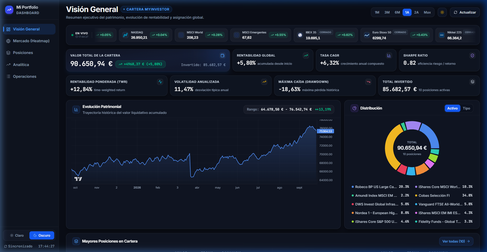

# 📊 Portfolio Dashboard

Un cuadro de mando financiero integral y moderno para el seguimiento de carteras de inversión multiactivo (fondos de inversión, ETFs, acciones y liquidez) con datos de mercado en tiempo real, mapas de calor interactivos y análisis avanzado de rentabilidad y riesgo.



---

## 🚀 Características Principales

- **📈 Visión General de la Cartera**:
  - KPIs principales: Valor Total, Capital Invertido, Ganancia/Pérdida neta (€ y %) y TWR.
  - Gráfico interactivo de evolución temporal de la cartera con selectores de período (`1M`, `3M`, `6M`, `1A`, `2A`, `5A`).
  - Distribución por clase de activo y categoría con gráficos de donut sincronizados.
- **🏆 Mayores Posiciones en Cartera**:
  - Ranking de las 10 mayores posiciones en formato dual paralelo.
  - Numeración correlativa (`1` a `10`).
  - Fechas de actualización de valor liquidativo (`Fecha Act.`).
  - Desglose por ISIN, Ticker, tipo de activo, rentabilidad latente y peso relativo sobre el total.
  - Modal detallado con gráfico histórico de cotizaciones, estadísticas clave y transacciones asociadas.
- **🔥 Mapa de Calor del Mercado (Heatmap)**:
  - Visualización TreeMap estilo Finviz del S&P 500 y mercados globales.
  - Filtrado interactivo por sectores económicos (Tecnología, Consumo, Financiero, Salud, Energía, etc.).
  - Modales con gráficos históricos de precios y métricas de cada cotizada.
- **⚡ Ticker de Mercado en Tiempo Real**:
  - Cinta continua con las principales cotizaciones del mercado (S&P 500, Nasdaq, Dow Jones, Euro Stoxx, IBEX 35, etc.).
  - Integración de logotipos oficiales de compañías y variación diaria.
- **📋 Gestión y Operaciones**:
  - Registro de transacciones (compras, ventas, dividendos).
  - Modal para añadir y gestionar nuevas operaciones.
- **🌓 Tema Claro / Oscuro**:
  - Sistema de temas persistente adaptado a preferencias visuales de alta gama.

---

## 🛠️ Tecnologías Utilizadas

### Frontend
- **React 18** + **TypeScript**
- **Vite** para desarrollo y empaquetado ultra rápido
- **Tailwind CSS** + **Framer Motion** para animaciones fluidas
- **Recharts** para gráficos financieros
- **TanStack Query (React Query)** para caché y sincronización de datos
- **Zustand** para la gestión de estado global
- **Lucide React** para iconografía moderna

### Backend
- **Python 3.10+** + **FastAPI**
- **SQLAlchemy** + **SQLite**
- **yfinance** para datos de cotizaciones y mercados en vivo
- **Uvicorn** servidor ASGI de alto rendimiento

---

## 📦 Instalación y Ejecución

### 1. Clonar el repositorio
```bash
git clone https://github.com/asmoren-deusto/Portfolio-dashboard.git
cd Portfolio-dashboard
```

### 2. Backend (FastAPI)
```bash
cd backend
python -m venv venv

# En Windows:
venv\Scripts\activate
# En Linux/macOS:
source venv/bin/activate

pip install -r requirements.txt
python -m uvicorn app.main:app --reload --host 0.0.0.0 --port 8000
```
La API estará disponible en `http://localhost:8000` y la documentación Swagger interactiva en `http://localhost:8000/docs`.

### 3. Frontend (React + Vite)
En otra terminal:
```bash
cd frontend
npm install
npm run dev
```
La aplicación web estará disponible en `http://localhost:5173`.

---

## ⚙️ Estructura del Proyecto

```
Portfolio-dashboard/
├── backend/
│   ├── app/
│   │   ├── routers/       # Endpoints: portfolio, market, transactions, assets
│   │   ├── services/      # Lógica de cálculo, scraping y proveedores de mercado
│   │   ├── database.py    # Conexión SQLAlchemy y SQLite
│   │   ├── models.py      # Modelos de base de datos
│   │   ├── schemas.py     # Esquemas Pydantic
│   │   └── main.py        # Inicialización de FastAPI y middleware
│   └── requirements.txt   # Dependencias de Python
├── frontend/
│   ├── src/
│   │   ├── api/           # Hooks de React Query y llamadas HTTP
│   │   ├── components/    # Componentes modulares (UI, charts, layout, market)
│   │   ├── pages/         # Páginas: Overview, Positions, Analytics, Transactions
│   │   ├── lib/           # Utilidades y datos mock de respaldo
│   │   └── store/         # Store global Zustand
│   ├── package.json       # Dependencias de Node
│   └── vite.config.ts     # Configuración de Vite
├── .gitignore
├── start.py               # Script para arranque conjunto
└── README.md
```

---

## 👤 Autor

- **Asier Moreno** ([@asmoren-deusto](https://github.com/asmoren-deusto))
